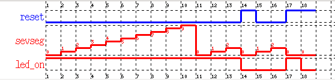

# MIF12-Lab 1: Arduino 101

  * Laure Gonnord, Université Lyon 1, LIP [email](mailto:laure.gonnord@univ-lyon1.fr)
  * Version: 2019.02
  * Inspired by a lab with Sebastien Mosser, UQAM, Montreal.
  * Other collaborators: Lionel Morel (Insa Lyon), Julien Forget (Lille)


## Problem Description 

In this lab you will be asked to write simple Arduino programs that
interact with sensors/actuators. 

## Step 0 : Hardware and Software setting.


You will be given a whole platform with an Arduino UNO, some leds, a
breadboard, wires ...  **You will be responsible for them for the
duration of this lab** On the breadboards, all points in a given
supply line (blue/black, read) are connected. Same for the
columns. More details about the experimental setup are available here:
[Board details](https://github.com/lauregonnord/mif18-labs/blob/master/TP01/_board.md)


The kick-off code of this lab is available under the [code directory](https://github.com/lauregonnord/mif18-labs/blob/master/TP01/_code)


## Step 0b : Arduino Programming Style


Here is the pattern we will use to program the Arduino :

```C
#include <avr/io.h>
#include <util/delay.h>

void setup(void) {}

int main(void)
{
  setup();
  while(1)
  {
    // Business code goes here
    _delay_ms(1000);
  }
}
```

The program to embed on the board implements an infinite loop, where the main behavior will be called. The `setup` procedure is used to initialize the board, //e.g.//, specify which pin is used as input or output.


## Step 1: A simple blinking LED (ex1/)

Connect the board so that to make a circuit with a led, a resistor and
the arduino pin 13:

<p align="center">
  
</p>


To switch a led on or off on a Arduino, we need to
* configure the port/pin where the led is connected into
  _reading mode_ (in the setup procedure)
* write a 0 (off) or a 1 (on) into the same port when required.

Some information:
* As the led is linked to digital pin 13, the port to be manipulated
  is DDRB, here every single pin from 8 to 13 is set to "input" (0)
  excepting bit 5 which gives an "output" access to the led (1).

* To make  the led blink, use  the xor
  operator to toggle the 5th bit from 0 to 1 or 1 to 0 each
  time we enter a different loop: `PORTB ^= 0bxxxxxxxx;' (replace x
  with bits values).


### Additional documentation (please have a look)

Other links:
* [port manipulation](https://www.arduino.cc/en/Reference/PortManipulation). Warning,
the documentation is for the Arduino Lib format. In raw C, you should use
`0b11111110` (rather than `B11111110`).
* [Boolean operators](http://playground.arduino.cc/Code/BitMath),
* [AVR libc doc for delays](http://www.nongnu.org/avr-libc/user-manual/group__util__delay.html).


## Step 2: Two LEDs with different frequencies (ex2/)

Now make two leds blink at different frequencies (the second one uses
PIN 12). Make your code as generic as possible.

In the README, explain your solution for different values of the
frequencies. Explain why is it satisfactory or not ? What would you
like as a developper.


## Step 3: Led, Button, 7 segment V1 (ex3/)

Here is the new component assembly:
<p align="center">
  
</p>
(More details [Board
details](https://github.com/lauregonnord/mif18-labs/blob/master/TP01/_board.md
))


The objective is to build the following behavior:
  1. Switch on or off a LED based on a button sensor;
  2. Building a simple counter using a 7-segment display;
  3. Compose the two behaviors so that the button control both the display and the LED.




### Expected work

* We give you a starting code.

* Add functionality for the button: write a `int get_reset_value()`
  function that reads on digital 10 (use `PINB` value and some boolean
  operators). Use it in the `main` to control the led (switch it on to
  off or off to on if the button is pressed). Do not forget to update
  the `setup` function if required. Test.

* Add functionality for the seven-segment display: write a `void
display_7seg(int value)` function to display a given number.
As an
  example, our version begins with:
```C
void display_7seg(int value){
  switch (value) {
  case 0: //a,b,c,d,e,f
    PORTD = 0b01111110;
    break;
	//todo: implement the rest!
}
```

And use it to increment the 7 segment value each time you enter the
  loop. If the button is pressed, the 7-segment should reset
  to 0. Test.


### Questions (TBD in README)
  - What can we say about readability of this code? What are the skills required to write such a program?
  - Regarding embedded systems, how could you characterize the
  expressivity (can all applications be written in that way) ?
  The configurability of the code to change pins or behavior? Its debugging capabilities?
  - Regarding the performance of the output code, what kind of parallelism is expressed by the use of the DDRx registers?
  - What if we add additional tasks in the micro-controller code, with the same frequency? With a different frequency?

## Step 4: Led, Button, 7 segment V2 (ex4/)

A little journey into the Arduino library. 

## The LED example
* Include `Arduino.h` and link with the lib (the Makefile does this
job):
```C
#include <avr/io.h>
#include <util/delay.h>
#include <Arduino.h>
```

* Now each pin has his own configuration and can be set independently
of the others:   `pinMode(led, OUTPUT);` for the led setup and
`digitalWrite(led, LOW);`,  `digitalWrite(led, HIGH);` to set the led
value.

* We have to store the led state in the `led_on` variable.


## Documentation & Bibliography

* The Arduino library
[reference](https://www.arduino.cc/en/Reference/HomePage). See
the `pinMode` and `digitalRead` documentation.


## Expected Work

* Implement the Button functionality. Test it!
* Implement the Seven Segment display functionnality: first implement `displayDigit`:
```C
void displayDigit(int digit)
{
  turnOff();
  //Conditions for displaying segment a
  if(digit!=1 && digit != 4)
    digitalWrite(a,HIGH);
	//continue
	}
```
and use it in the main. Test it!


## Feedback Questions

  - Is the readability problem solved?
  - What kind of parallelism can still be expressed?
  - Who is the public targeted by this "language"? It it ok for
    (real-time) system programmers ? 
  - Is this language extensible enough to support new features?
  - What is the price for the developer?
