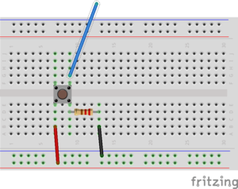

# Experimental Platform description

## Pre-installation (Arduino stuff)

  * You may have to install the following (Linux) packages: `arduino` ,
`gcc-avr` (or `avr-gcc`) and `avrdude` (`avr-binutils` et `avr-libc` if they are not included)
  * `avrdude.conf` must be in `/usr/share/arduino/hardware/tools/` (if not you have to modify Makefiles).
  * The user should have the right to write on  the USB port :
`usermod -aG dialout <username>` (and re-login).

### Some Arduino general information

Arduino/Genuino cards are free cards build around a Atmel AVR
microntroler. In this lab we will use  Arduino UNOs (atmega328p) like
in the following picture. The platform has a few numerical and
analogic I/Os where we will connect LEDs, buttons, seven segment led
displays...

The microcontroler itself is programmed with a bootloader so that a dedicated
system is not necessary. The Makefile we give you will use   `avrdude`
[doc](http://www.nongnu.org/avrdude/) to load the binaries into the
microcontroler memory.

You will be given a whole platform with an arduino UNO, some leds, a
breadboard, wires ...  **You will be responsible for them for the
duration of the lab** On the breadboards, all points in a given
supply line (blue/black, red) are connected. Same for the columns.

## Getting started with the breadboard.

First of all, make a simple circuit to test the board itself: 

The board should be powered : blue/black line to arduino ground (GND)
and red line to arduino +5V. Plug the arduino to the USB port of your
laptop, the led should shine. 

Now, let us program a blinking LED. 

**From now, shematics implicitely contain the wire required to power
the board (link from red lines to 5V, link from blue/black lines to GND)**

### LED on Digital 13

* Led on digital 13 with 220 ohm resistor. (long leg to digital 13)

### Button on Digital 10

* Button on digital 10, and 220 ohm resistor.

### Arduino/7seg on Digital 1 to 7

* The seven segment displays can be "common cathode" or "common anode"
  (vertical common anode for us!)

* 7 segment : a on digital 1 via resistor 220 ohm, b on digital 2, ...
  g on digital 7, according to the preceding numbering. For instance,
  for out setting (common anode, vertical):

**Warning, the 7 segment display should be connected though resistors
(from 220 to 400 ohm)**
