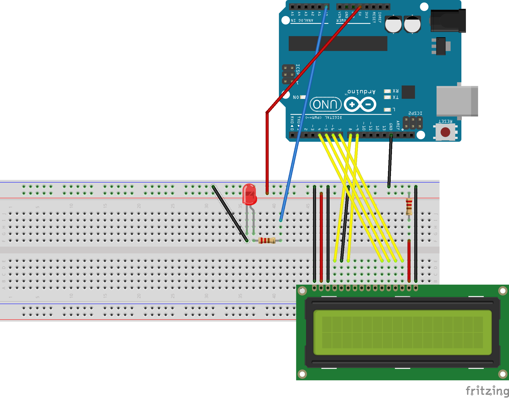

# MIF12-Lab 2: Round Robin Scheduler on Arduino.

  * Laure Gonnord, Université Lyon 1, LIP [email](mailto:laure.gonnord@univ-lyon1.fr)
  * Version: 2019.02
  * Inspired by a lab with Julien Forget and Thomas Vantroys, Lille
  * Other collaborators: Thierry Excoffier (Lyon1)
  * Deadline : TBA

## Problem Description 

In this lab you will implement a simple scheduler for Arduino with
timers and interruptions.

## Step 0 : Hardware and Software setting.

Same software setting as in Lab1. Hardware settings: see later.

The kick-off code of this lab is available under the [code directory](https://github.com/lauregonnord/mif18-labs/blob/master/TP02/_code)


## Step 1 : 2 leds in parallel, with timers

Dans cet exercice, au lieu d'utiliser l'attente active (wait) en
bidouillant pour réaliser le parallélisme, on se propose d'utiliser
l'un des timers du micro-contrôleur pour faire clignoter les deux LEDs
à deux fréquences différentes, la LED rouge clignotera toutes les
200ms et la LED jaune toutes les 400 ms en parallèle. Le montage est
le suivant: led rouge sur analog 1, led jaune sur analog 1.

Afin de faire clignoter la LED jaune toutes les 400 ms en parallèle de
la LED rouge,  nous allons utiliser un timer~:
* Le main continue d'allumer la LED rouge comme dans le TP1
* Toutes les 400 ms, une fonction d'interruption sera
  appelée. Elle réalisera le changement d'état de la LED jaune, puis
  rendra la main. 

### Documentation

Explication des [timers/interruptions](/TP02/ArduinoTimers.md)

### Expected work
Dans le fichier `main.c` du répertoire `ex1`:
* Écrivez le code de la fonction `task_led_red` qui fait
  clignoter la LED rouge toutes les 200 ms (i.e., la LED est allumée
  pendant 200 ms, puis éteinte pendant 200 ms). Cette fonction est
  appelée dans la boucle de la fonction `main`. Testez le bon
  fonctionnement. 
* Déterminez la valeur du nombre NB_TICK pour initialiser le
  registre OCR1A, afin que la fonction d'interruption soit appelée
  toutes les 400 ms.
* Remplissez la fonction `ISR` pour réaliser le changement d'état de
  la LED jaune.

Grâce à l'utilisation du timer, vous avez pu réaliser ainsi deux
tâches qui s'exécutent en parallèle.

## Step 2: Scheduler

Vous allez maintenant réaliser un véritable ordonnanceur utilisant
un algorithme _Round Robin_ avec un intervalle de temps de 40
ms. Votre micro-contrôleur réalisera trois tâches :
* faire clignoter la LED rouge toutes les 300 ms.
* envoyer en boucle un message sur le port série (chaque envoi de
  caractère sera espacé de 100 ms).
* envoyer en boucle un message sur un mini écran LCD (avec une API fournie).


### Circuit

On a toujours les deux LEDs (rouge sur Analog 0, jaune sur Analog 1),
et on ajoute un écran LCD comme sur le dessin ci dessous:

<p align="center">
  
</p>

Les deux LEDs sont câblées comme précédemment.
* Le LCD est relié aux ports ``digital'' suivant lcd(4)-> D8, lcd 6->
  D9, lcd11 -> D4, lcd 12 -> D5, lcd13 -> D6, lcd14 -> D7.
* Le reste du branchement sert à assurer l'alimentation, la
  stabilité, et le contraste.
  
### Écriture série, stty et screen.

L'écriture port série s'effectue en fait sur
`/dev/ttyACM0`. Pour visualiser ce qui est écrit sur le port série,
nous utilisons `stty` pour configurer la lecture (voir le
Makefile), et le logiciel `screen`(voir
https://www.gnu.org/software/screen/), dans un terminal
différent de celui utilisé pour compiler/uploader:
```
screen /dev/ttyACM0 9600
```

Pour quitter proprement screen, on fera `CTRL-a`, puis `k`
(kill).

Alternativement vous pouvez directement faire~:
```
make && make upload && (stty 9600 ; cat) </dev/ttyACM0
```

### Travail préliminaire


Ici chaque tâche effectuera une boucle infinie (et les `delay_ms`
aussi). Le code fourni se trouve dans le répertoire `scheduler`:
* Testez la tâche LED rouge (de période 300 ms).
* À l'aide de la fonction `send_serial` fournie (qui envoie
  un caractère sur le port série), écrivez une tâche qui écrit le
  message de votre choix sur le port série en envoyant caractère par
  caractère toutes les 100 ms. Testez cette tâche.
* Écrivez le code de la tâche écrivant une chaîne sur l'écran LCD
  toutes les 400
  ms. Vous utiliserez~:
  * `lcd_write_string_4d(s)` pour imprimer une
    chaîne. Attention cette tâche elle même prend du temps (allez
    regarder le code de la librairie).
  * `lcd_write_instruction_4d(lcd_Clear)` pour effacer le
  texte courant.
* Testez individuellement chacune de ces tâches.


### Ordonnanceur RR sans sauvegarde de contexte (V1)


Maintenant que vos différentes tâches fonctionnent, vous pouvez
réaliser l'ordonnanceur. Vous devez commencer par créer une structure
(tableau de structs) représentant les différentes tâches (ici
3). Chaque structure de tâche sauvegardera ici son état (`RUNNING`,
`NOT_STARTED`):
 ```
typedef struct task_s {
        volatile uint16_t stack_pointer; // variable pour stocker SP
        volatile uint8_t state;         // RUNNING ou NOT_STARTED
   // vous pouvez ajouter (un pointeur vers) la fonction de la tâche
} task_t;
```
L'ordonnanceur suivra donc l'algorithme suivant~:
```
  currentask <- nexttask()
  if currenttask.state == RUNNING //la tâche a déjà été interrompue
     then
          currenttask.relaunch(); 
     else  // premier lancement de la tâche
          currenttask.state = RUNNING ;
          sei();                 //permettre les interruptions. 
          currenttask.launch();
  endif
```
Codez cet ordonnanceur (répertoire scheduler/)
* Vous utiliserez toujours un timer qui lancera une interruption
  régulièrement.
* La période de l'ordonnanceur sera de 40 ms. Pour faciliter le
  debug, chaque fois que l'ordonnanceur s'exécute, vous allumerez la
  LED jaune.
* Mettez en évidence le problème de non-restoration de contexte~:
  les tâches reprennent toujours au début.
* Après avoir testé, sauvez cette v1 dans un répertoire à part `scheduler/V1/`


### Ordonnanceur avec sauvegarde de contexte (V2)

Pour pouvoir reprendre l'exécution d'une tâche ``au bon endroit''
après interruption, il faut sauvegarder ``le contexte'', ie l'ensemble
des valeurs des registres à une certaine adresse dans la pile (SP) au moment de
son interruption. On modifiera la structure de tâche en:
```
typedef struct task_s {
        volatile uint16_t stack_pointer; // variable pour stocker SP.
        volatile uint8_t state; // toujours RUNNING ou NOT_STARTED
        // here you can add the associated task
} task_t;
```
Pour une
  explication du volatile [clic](https://en.wikipedia.org/wiki/Volatile_(computer_programming))

#### Un point sur le changement de contexte

Comme on l'a déjà vu en architecture, pour réaliser le changement de
contexte, il est nécessaire de
sauvegarder la valeur des différents registres du
micro-contrôleur (Lire aussi
[multitasking](https://xivilization.net/~marek/binaries/multitasking.pdf))

Pour cela, on vous fournit deux macros `SAVE_CONTEXT` et
`RESTORE_CONTEXT`. Pour la gestion de la mémoire des
différents processus, nous allons découper l'espace mémoire. Dans un
AVR atmega328p, la mémoire est utilisée en commençant par les adresses
les plus élevées. La tâche "écriture série" débutera son utilisation
mémoire à l'adresse 0x0700, la tâche "écriture écran LCD" débutera à
l'adresse 0x0600 et la tâche "LED" débutera à l'adresse 0x0500. Ces
adresses représentent le départ du pointeur de pile (Stack
Pointer). Ce dernier est rendu directement accessible par
`gcc-avr` via la "variable" SP.

L'ordonnanceur réalisera donc l'algorithme suivant~:
```
  SAVE_CONTEXT();       // sur la pile
  currenttask.saveSP(); // sauver le SP dans la tâche
  sei();          // permettre les interruptions
  currenttask <- nexttask()
  SP = currenttask.getSP();
  si currenttask.state == RUNNING //la tâche a déjà été interrompue
     alors 
          RESTORE_CONTEXT()
     sinon  // premier lancement de la tâche
          currenttask.state = RUNNING ;
          currenttask.launch();
  finsi
  ```


####  TODO : Dans le main:

* Observez les deux macros de stockage du contexte. Attention,
  dans ces macros, on appelle la fonction \verb!cli! pour stopper les
  interruptions. La conséquence est qu'il faudra relancer \verb!sei! à
  chaque reprise en main de l'ordonnanceur.

* Modifier l'ordonnanceur Round Robin précédent (avec un
  intervalle de 40 ms)  et testez-le.

* Sauvegardez cette version dans `scheduler/V2/`


### Ordonnanceur avec ressource partagée. 

On souhaite maintenant rajouter une tâche supplémentaire qui envoie en
boucle le caractère `'@'`  sur le port série. Ceci nécessite donc
de gérer l'accès concurrent au port série entre deux tâches.

Vous allez mettre en place un mécanisme simplifié de sémaphores
permettant d'assurer l'accès en exclusion mutuelle au port série. 

Voici une solution possible: chaque tâche a désormais trois statuts
possibles: `CREATED` (la
tâche n'a encore jamais été exécutée), `ACTIVE` (la tâche est
disponible) et `SUSPENDED` (la tâche attend l'accès à une ressource
partagée).


#### TODO

* Faites une étude sérieuse du problème
Écrivez une primitive `take_serial` (similaire au P/Wait
  des sémaphores), qui vérifie si le port série est disponible, si oui
  le prend, si non la tâche l'exécutant est suspendue.

\item Écrivez une primitive `release_serial` (similaire au
  V/Signal des sémaphores), qui rend le port série et, si besoin, rend
  active la tâche suspendue.

\item Modifiez le code des tâches et de l'ordonnanceur en
  conséquence. Notez bien que les primitives `take_serial` et
  `release_serial` doivent être ininterruptibles !

* Commentez correctement votre code, documentez dans un
  README. Sauvegardez cette version dans `scheduler/V3/`
  


### Rendu tgz de tout, avec un README

TBA
