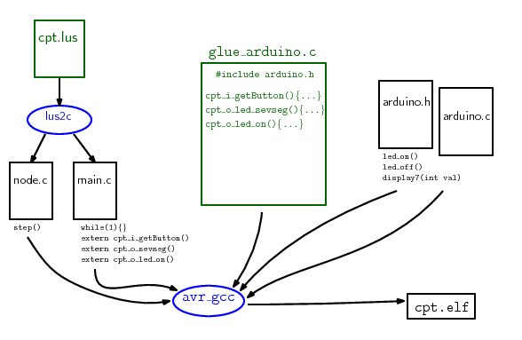

# MIF18 - Lab 5 Lustre Arduino.

  * Laure Gonnord, Université Lyon 1, LIP [email](mailto:laure.gonnord@ens-lyon.fr)
  * Version: 2019.01


## Objectives
  0. Play a bit with the Lustre language and simulator	
  1. Use the Lustre synchronous language and compiler to code some
     arduino functionalities 
  2. Abstract low level I/O through glue code;
  3. Abstract the FSM in a unique step function.

## Getting Started!

First launch the script to install Lustre, and play with the provided Lustre examples
and the luciole simulator:
```
luciole edge.lus edge
```

In luciole, use "sim2chro" functionality to play with I/Os and draw
timing pictures.

## Write variants of counters

a first counter:
```
node count (r: bool) returns (c:int);
let
  c = 0 -> (1+pre(c));
tel 
```
Modify this counter:
* to reset it when the input signal r(reset) is true
* to have an initial value different from 0 and an increment different
  of one.
* Use this last one to enumerate the even numbers
* Create a modulo 5 counter.

## The LED example


* In Lustre, things are simple, we encode the sequence of values of
boolean or numerical variables into _nodes_. The compilation chain does the rest!

```
node cpt(reset:bool) returns  (led_on: bool) ;
let
   led_on = false -> not(pre(led_on));
tel
```

* Observe the  `glue_arduino.c` and `main.c` files. The main loop is
  still encoded by the user, but the rest of the functionnality: the
  `step()` function is not.

* After compilation, observe the automatically generated `cpt.c`
  file. The Lustre compiler (`lus2c`) has been invoked.

## Now encode the 7seg + Button functionalities.

Take inspiration from Lab 1 and encode the same functionality, in
Lustre. Simulate your lustre code (luciole) and adapt the glue
library.

Bonus if you encode a functionality involving the LCD screen.

## Documentation & Bibliography

Lustre is a language that was designed for safety critical systems
(avionics, nuclear plants), in Grenoble, in the late 80s. Its
industrial version Scade is still used by Airbus.

* Have a look into the
[Lustre V6 official webpage](http://www-verimag.imag.fr/Lustre-V6.html?lang=fr)
We will use the V4 distribution but the language description is
accurate in the V6 documentation.

* Lustre Compilation Flow:


* The Lustre compiler comes with some other tools like a simulator, and
 a model checker. If you have time, you can play with them and try to
 prove simple properties.

## Expected Work


* In the directory `LustreArduino`, modify the Lustre code to enable
the button (reset is true if the button has value 1). You will have to
modify `main.c` and the glue code.

* Modify the Lustre code  for the seven segment display. Compile,
test!

## Rendu
	pas de rendu cette fois mais il faut avoir une chaîne
    fonctionnelle pour le prochain TP Lustre.
