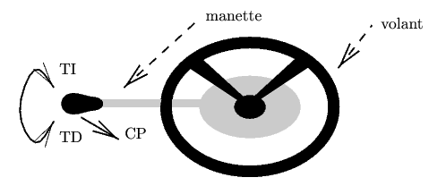
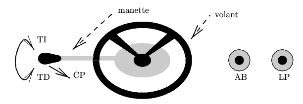

# MIF18 - Lab 6 Lustre Arduino.

  * Laure Gonnord, Université Lyon 1, LIP [email](mailto:laure.gonnord@ens-lyon.fr)
  * Version: 2019.01

## Objectives
	1. Play with the lustre ecosystem
	2. Design and validate a controler from Lustre to Arduino.

## Getting Started!

* Same setting as in the preceding Lab for
  Lustre. [link](https://github.com/lauregonnord/mif18-labs/blob/master/TP05/README.md)
* Launch the magic script `lance_lustre.sh` to have a full Lustre environment in your shell.
* Platform : The same as in Lab 1 + 2 additional buttons.
* [doc/biblio (lab5A)](https://github.com/lauregonnord/mif18-labs/blob/master/TP05/README.md)

## Lustre and verification tools.

### The model checker `lesar` and its GUI.

To understand what is lesar and make a first tour of it, make the
second exercice
[here](http://francois.touchard.perso.luminy.univ-amu.fr/IRM5/Langages/TD2-Lustre.html)
you might have to edit the xlesar script to change `wish8.5` into
`wish` (always in the Lustre environment designed for you).

###  Exercise (play with lesar)
  
  Write a Lustre node `nonnon` which computes the inverse of its
  boolean entry. Add an observer that says false if there has been a
  step when the ouput of the this node has been false in the past. 
  
  * Test with `luciole` and shows that there are behaviors where this
    observer says false.
  * Use `lesar` to find such an example automatically.
  * Add in the observer an assertion `assert(x)` that behaves like an
    asumption (`x` is the calling arguments of the `nonnon` node). Now
    prove the functionality with this asymption in lesar.

### Exercise (jafter)

Write and simulate a node `jafter(x:bool)` which is true if the
    signal `x` was true in the preceding period.

### Exercise (switch)

Write and simulate a `switch` node whith 3 entries: `orig,on,off`
    and one output : `state` (all booleans). The expected behavior is
    that the initial value of the output is the one of `orig`, and its
    values changes from false to true when `on` is true, and from true
    to false when `off` is true, else it remains stable.
	
### Exercise

Write and simulate an observer `once_from_to(X,A,B)` which is true
    si for all interval beginning by a 'A' and finishing by a 'B',
    there exists at least one occurence of X. (use the `switch` node).
    Indication: complete the following sentence: "the output is false
    if it has been false in the past or ..."

## Un contrôleur de feux de voitures. (_code/controlerV1)

  

Nous allons coder en Lustre la fonctionnalité suivante:

* La manette peut être tournée dans le sens direct (TD) ou indirect
  (TI)

* A partir d'une situation initiale où tout est éteint, TD allume les
veilleuses, un second TD éteint les veilleuses et allume les codes;
Lorsqu'on est en codes ou en phares, TI les éteint et rallume les
veilleuses, un second TI éteint tout;

* Le fait de tirer la manette vers l'avant (CP) permet de commuter
entre codes et phares; lorsqu'on est en codes, CP éteint les codes et
allume les phares, un second CP éteint les phares et rallume les
codes; Le conducteur ne peut pas simultanément tourner et tirer la
manette.

### Lustre Part

* Draw the automata corresponding to the different states of the
  lights, and the actions that enables the states to change. Two
  hints: 1) it is useful to reason with an auxiliary state
  `all_lighs_off`. 2) changing a state can be done by defining cases
  to enter in (the "on" case of the `switch`) and the cases that
  enables to quit (the "off" case)
  
  
* Encode this automata in Lustre using intensively the `switch` node
  (4 variables definitions: one per state of the automaton.). This
  automata has 3 outputs.

* Simulate ! 

### Arduino Part
	
The objective is to make the controler work on the Arduino platform:
* 7 seg: 3 distincts codes for the 3 different lights
* 3 buttons for the 3 inputs (TD,CI,CP)
* A led or two for the debug.

Steps:
* generate the main simulation loop with `lus2c feux.lus feux -loop`
  to obtain the main simulation loop with function calls to get inputs
  and set outputs.
* erase all mentions to the standard input and outputs, add an
  explicit call to `add_delay_ms` and include libs.
* from the preceding lab, adapt the Makefile and the arduino lib. 
* ...

## Controler V2 (_code/controlerV2)

Voici la V2 du contrôleur de feux! On ne demande que le Lustre.

  

On ajoute à présent des projecteurs antibrouillard et de longue
portée. Deux boutons-poussoirs permettent d'activer les feux
antibrouillard (bouton AB) et les longue portée (bouton LP), comme
illustré ci-dessus.

* Le rôle de la manette est inchangé.

* A partir d'une situation initiale, une pression sur AB (resp. LP)
  sélectionne les antibrouillard (resp. les longue portée), et une
  seconde pression les désélectionne.
   
* Les antibrouillard (resp. les longue portée) ne sont allumés que
  quand on est en codes (resp. en phares). Dans ce cas, ils ne sont
  allumés que s'ils sont sélectionnés.
  
Indications: on conserve les entrées et sorties de la version simple, auxquelles on
ajoute :
* deux entrées AB et LP vraies à chaque pression du bouton
  correspondant.
* deux sorties `anti_brouillard` et `longue_portee` représentant
  l'état des projecteurs d'antibrouillard et de longue portée (vrai :
  allumé, faux : éteint).

On conseille d'utiliser la même méthodologie que précédemment, à base d'automate.

### Verification

En utilisant `lesar` (ou `xlesar`), vous essayerez de prouver les propriétés suivantes sur le contrôleur de feux (étendu) :
* veilleuse, code et phare sont exclusifs. (on pourra utiliser
  l'opérateur d'exclusivité `#`).
* on ne peut être en antibrouillard que si on est en code.
* on ne peut être en longue-portée que si on est en phares.

Ces propriétés seront écrites comme des observateurs dans le code
rendu.

Si une preuve échoue : utiliser l'option "Diagnosis" de `xlesar` pour
obtenir un contre-exemple. On sera éventuellement amené à introduire des hypothèses sur les entrées pour mener à bien la preuve.

### Arduino : not mandatory

Bonus si vous le faites. Vous pouvez aussi ajouter une fonctionnalité
d'allumage auto des phares à l'aide du capteur de lumière !

## Rendu
 Les deux controleurs, le code qui fonctionne sur Arduino pour la V1,
 et une vidéo filmant une démo.
